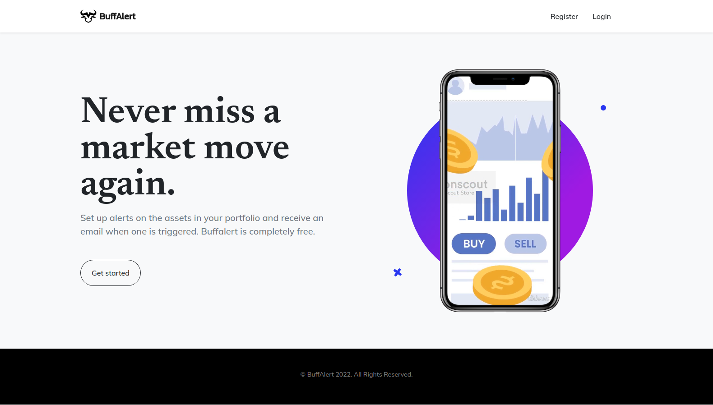

# BuffAlert

**BuffAlert allows users to set stock alerts and receive free email when the price they are monitoring is reached.** 
It works using [cron](https://edouardproust.dev/blog/python-deploy-a-cron-job-on-heroku_8) for the automation part and [iexcloud API](https://iexcloud.io/docs/) for the quote. 
Each user must subscribe to an iexcloud account and get an personal API key in order not to exceed the limit of requests of the Free plan (all the steps to do so are clearly explained to the user).

➡ **Live demo:** https://buffalert.xyz<br/>
➡ **Video demo:** https://vimeo.com/756163443



## Requirements

```
flask
flask-session
flask-sqlalchemy
mysql-connector-python
gunicorn
requests
apscheduler
werkzeug
python-dotenv
datetime
calendar
```

## Upcoming updates

- **Add more assets:** At the moment, BuffAlert works with US stocks only. The next release will allow user to set alerts on commodities, currencies (forex) and crypto-currencies.
- **Password recovery:** Add the possibility for the user to reset his/her password by sending a email containing a verification token.
- **Simultaneous alert checks on cronjob:** At the moment the checking of alerts is done one alert at a time. If the number of users becomes high, the check launched every hour by the cronjob will be very long. This version is intended to make cronjob perform each alert check simultaneously. This is possible because each user has his own API key, so each request will be separate.

## Development

1. Clone the repository
2. Ensure that in `config.py`, `DEV_MODE` is on `True` and rename `..env` file into `.env`. In `.env` update database credentials depending on your local setup (you'll have to install and configure mysql if not done already).
3. Install dependencies
```bash
pipenv shell # launch virtual environment (if port already in use: `npx kill-port <port>`)
pipenv install # Install dependencies listed in Pipfile
```
4. Create database
```bash
python3 -c 'from cli.db import create'
```
5. Create tables
```bash
python3 -c 'from models import db; db.create_all()'
```

6. Set emails with Mailtrap
- Create a [Mailtrap](https://mailtrap.io/register/signup) account
- Go to [Dashboard](https://mailtrap.io/inboxes) > My inbox (in "Projects" list) > In tab "SMTP Settings" click on Show Credentials > Past values into `.env` file (`MAILTRAP_USERNAME` and `MAILTRAP_PASSWORD`).

7. Run the app
```bash
gunicorn app:app
```
8. Launch alerts cronjob
```bash
python3 -c 'from cli.cron import check_alerts'
```

9. (Optional) Create first user (credentials: test@test.com / test)
```bash
python3 -c 'from models import User; User.create("test@test.com", "test")'
```

## Production

We will use [Heroku](https://www.heroku.com/) to deploy the app.

1. Ensure that in `config.py`, `DEV_MODE` is on `False`.

2. Create a repository on Heroku
```bash
heroku create <app_name>
```
3. Add a Buildpack for Python:
```bash
heroku buildpacks:set heroku/python -a <app_name>
```

4. Push code to heroku
```bash
git init
heroku git:remote -a <app_name>
git add .
git commit -m "First commit"
git push -u heroku master # or: `git push heroku <branch_name>:master`
```

5. Set database ([full tuto](https://roytuts.com/how-to-deploy-python-flask-mysql-based-application-in-heroku-cloud/))
```bash
# Add JawsDB addon
heroku addons:create jawsdb
# Get the db credentials 
heroku config | grep JAWSDB # Returns a string like `mysql://{user}:{password}@{host}:{port}/{database}
# Set the environement variables (these variables will replaces the ones in the .env file):
heroku config:set DB={database}
heroku config:set DB_USER={user}
heroku config:set DB_USER_PASSWORD={password}
heroku config:set DB_HOST={host}
```

6. Create tables
- Use this command with the previous credentials:
```bash
mysql -h {host} -u {user} -p # and enter {password} when prompted
```
- In the terminal, past the content of the `cli/db/buffalert.sql` file.
- Verify database:
```
mysql> SHOW DATABASES;
+--------------------+
| Database           |
+--------------------+
| abc123def456ghi7   |
| information_schema |
+--------------------+
mysql> USE abc123def456ghi7;
Database changed
mysql> SHOW TABLES;
+----------------------------+
| Tables_in_abc123def456ghi7 |
+----------------------------+
| alert                      |
| stock                      |
| stock_category             |
| user                       |
+----------------------------+
```

7. Set emails with Mailgun
- Register a domain for 1$ on [Namecheap](https://www.namecheap.com/domains/).
- Create an account on [Mailgun](https://login.mailgun.com/login/) (don't use Heroku's Mailgun addon). Then go to [Upgrade](https://app.mailgun.com/app/account/mailgun/upgrade) page > Choose the "Foundation Trial" plan (bottom of the page). Enter your credit card details (Pro-tip: always use a *single-use* virtual card to pay online).
- On Mailgun, go to the [Domains](https://app.mailgun.com/app/sending/domains) page > Click "Add New Domain" button. Enter the domain ou just registered on Namecheap.
- Go to "Sending" on the left-menu > "Domain settings" > Choose your new domain in the top-right selector > Click on "SMTP Credentials" tab. Set the variables as follow, replacing `{login}` and`{password}` by the values given by Mailgun:
```bash
heroku config:set MAILGUN_SMTP_HOSTNAME=smtp.eu.mailgun.org
heroku config:set MAILGUN_PORT=587
heroku config:set MAILGUN_LOGIN={login}
heroku config:set MAILGUN_PASSWORD={password}
```
- On the same page, click on "DNS records" tab. In Namecheap [Domain List](https://ap.www.namecheap.com/domains/list/) page > click on "Manage" button for your domain > Click on "Advanced DNS" tab. Copy/past here all the DNS records from Mailgun. Check the DNS propagation with tools like [this one](https://dnschecker.org/).

8. Launch flask app and cronjob (set [dynos](https://devcenter.heroku.com/articles/heroku-cli-commands#heroku-ps-type-type))
```bash
# These commands activate the tasks listed in `Procfile` file.
# Launch flask app:
heroku ps:scale web=1
# Launch cronjob on `check_alerts.py':
heroku ps:scale clock=1
```

9. Visit the app: 
```bash
heroku info -s | grep web_url | cut -d= -f2 
# And click the link ;)
```

10. (Optionnal) Set a domain name and add SSL encryption 
- Follow [this tutorial](https://devcenter.heroku.com/articles/custom-domains)
- Set up SSL using [Cloudflare](https://dash.cloudflare.com/login/): Go to "SSL/TLS" page > Choose "Flexible" encryption mode. Then go to "Edge Certificates" page > In the "Edge Certificates box, follow the the instructions to add the TXT records (in "DNS" page). The Status should change to "Active" automatically after a few minutes. In "Edge Certificates" check "Always Use HTTPS" and "Automatic HTTPS Rewrites".


### Manage database: 

Localy using CLI:
```bash
mysql -u <username> -p
# Full MySQL commands list: www.interviewbit.com/blog/mysql-commands
```

Localy using GUI:
1. [Install PhpMyAdmin](https://www.linuxshelltips.com/install-phpmyadmin-in-linux/)
2. Go to http://localhost/phpmyadmin

Online (Heroku) using CLI:
```bash
heroku config | grep DB
# DB:               abc123
# DB_HOST:          abc123.abc123.us-east-1.rds.amazonaws.com
# DB_USER:          abc123
# DB_USER_PASSWORD: abc123
# ...
mysql -h {DB_HOST} -u {DB_USER} -p # and enter {DB_USER_PASSWORD} when prompted
# Then navigate and do queries in the database: www.interviewbit.com/blog/mysql-commands
```

Online using GUI:
```bash
# Install MySQL Workbench
sudo snap install mysql-workbench-community
# Then add a new connexion with the heroku DBJaws credentials.
# Get them with this command:
heroku config | grep DB
```

## Tips

- Check Heroku logs: `heroku logs --tail` (full list of the correct timezones [here](https://en.wikipedia.org/wiki/List_of_tz_database_time_zones))
- Get Status of working processes on Heroku (dynos): `heroku ps`
- Edit Heroku logs timezone: `heroku config:add TZ="Europe/Paris"`
- On dev environement on Linux, access the local database files in: `admin:///var/lib/mysql/{db_name}` folder

## Links
- [FLask-SQLAlchemy - Models definition](https://flask-sqlalchemy.palletsprojects.com/en/2.x/quickstart/)
- [FLask-SQLAlchemy - Db Queries syntax](https://flask-sqlalchemy.palletsprojects.com/en/2.x/queries)
- [Theme StartBootstrap](https://startbootstrap.github.io/startbootstrap-new-age/)